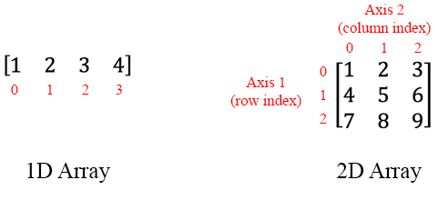
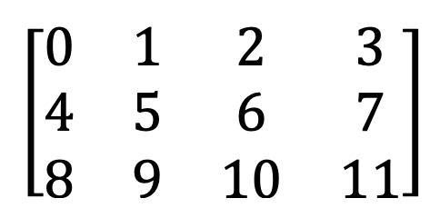
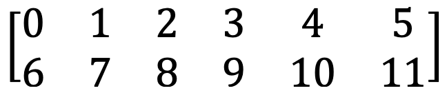

```python
from IPython.core.display import display, HTML

display(
    HTML("<style>.prompt{width: 0px; min-width: 0px; visibility: collapse}</style>")
)
```


<style>.prompt{width: 0px; min-width: 0px; visibility: collapse}</style>


# Introduction to NumPy Arrays for Data Scientists

Learn what is a NumPy array, why do we use them in data science, and how to get started.


In this article, we will introduce you to the popular Python scientific library called [NumPy](https://numpy.org/) (short for Numerical Python). Along with [Pandas DataFrame](https://pandas.pydata.org/), a NumPy array is a very useful data structure in your data science workflow.

By the end of this article, you will learn the following about NumPy arrays in the context of data science:

1. What exactly is a NumPy array
2. Why is it different from a list
3. How to index, slice, and reshape arrays

## What is a NumPy array?

An array is a data structure of the NumPy library that contains raw data elements, how to locate an element and how to interpret an element. Simply put, they are 1-dimensional or multi-dimensional matrices.

At first glance, a NumPy array looks very similar to built-in Python list.


```python
my_list = [1, 2, 3, 4, 5, 6]  # A list
print(my_list)
```

    [1, 2, 3, 4, 5, 6]


```python
import numpy as np

my_array = np.array([1, 2, 3, 4, 5, 6])  # A NumPy array
print(my_array)
```

    [1 2 3 4 5 6]


You can see that a list have elements separate by a comma but a array does not. However, the biggest difference is that a NumPy array can only contain <i>homogeneous datatypes whereas a list can contain </i>heterogeneous datatypes.


```python
print(np.array([1, 2, 3, 4, 5, 6]))  # A 1D array of integers
print(np.array(["dog", "cat", "fish"]))  # A 1D array of strings
print(np.array([[1, 2, 3, 4, 5, 6], [6, 7, 8, 9, 10, 11]]))  # A 2D array
```

    [1 2 3 4 5 6]
    ['dog' 'cat' 'fish']
    [[ 1  2  3  4  5  6]
     [ 6  7  8  9 10 11]]


```python
print([1, "dog", False, 2, "cat", True])  # A list of integers, strings, and boolean
```

    [1, 'dog', False, 2, 'cat', True]


## Why use NumPy array?

There are several advantages to using a NumPy array over a list:
* speed - it's much faster
* efficiency - it takes less memory
* functionality - it enables you to do more

These advantages are very important for a data scientist. <b>Speed</b> and <b>efficiency</b> is important because you will often work with extremely large datasets with millions of rows or thousands of columns. Using NumPy arrays will enable you to use less resources in ingesting and transforming your data, perform exploratory data analysis, and  train your models faster.

<b>Functionality</b> is also important because NumPy arrays were designed to allow you to do scientific calculations. You will find that many machine learning libraries such as [scikit-learn](https://scikit-learn.org/) uses NumPy arrays because of it's functionality. For example, if you want to scale your data by a multiply every element by 3, you will find that it is easier to perform such calculation on an array than a list.


```python
print(my_list * 3)
```

    [1, 2, 3, 4, 5, 6, 1, 2, 3, 4, 5, 6, 1, 2, 3, 4, 5, 6]


```python
print(my_array * 3)
```

    [ 3  6  9 12 15 18]


## How do we work with NumPy array ?

### Accessing/Indexing



We access the elements of an array using square brackets. When you’re accessing array elements, remember that indexing in NumPy starts at 0 so an index of 0 is the first element, index of 1 is second element, and so on.


```python
print(my_array[0])  # First element of 1D array
```

    1


We access an N-dimensional array using square brackets also but each dimension (called an <i>axis</i> in NumPy) is separated by a comma. Let us look at how to index a 2D  array.


```python
# Define a 2D array. The 1st axis has 2 elements and 2nd has 5 elements
my_2darray = np.array([[1, 2, 3, 4, 5, 6], [7, 8, 9, 10, 11, 12]])
print(my_2darray)
print(my_2darray[0, 0])  # First element of axis 1, first element of axis 2
print(my_2darray[1, 3])  # Second element of axis 1, fourth element of axis 2
```

    [[ 1  2  3  4  5  6]
     [ 7  8  9 10 11 12]]
    1
    10


### Slicing

In training a machine learning model, you want to split your data into a training and testing set by specifying the number of rows for split. Slicing an array is one way to do so.

We use square brackets to slice an array. The notation to slice is defined by <i>my_array[start_index:end_index:step]</i>. Note, you do not have to specify all of the index inputs.

* No start index means start at 0
* No end index means end at the length of the array
* No step will default to step = 1


```python
print(my_array[0:3])  # Slice for the first 3 elements
print(my_array[2:])  # Slice starting at element 2 until end of array
print(my_array[0:5:2])  # Slice for every 2nd element
```

    [1 2 3]
    [3 4 5 6]
    [1 3 5]


You can also use negative indexes which starts the slicing at the end of the array.


```python
print(my_array[-2:])  # Slice the last 2 elements
print(
    my_array[-4:-1]
)  # Slice starting from the second element and ending before the last element
```

    [5 6]
    [3 4 5]


For N-dimensional arrays, we separate our axis slice by a comma. Lets take a look at how slicing works for 2D arrays.


```python
print(
    my_2darray[0:2, 0:2]
)  # Slice first two element of axis 1, first two element of axis 2
print(my_2darray[1, 1:4])  # Slice first three element of axis 2
```

    [[1 2]
     [7 8]]
    [ 8  9 10]


### Shape/Reshaping

The shape of your data is very important. For example, certain models such as Convolutional Neural Networks (CNNs) requires you to specify the shape of your data as an input.

We can view the shape of a NumPy array using the function [shape](https://numpy.org/doc/stable/reference/generated/numpy.shape.html).


```python
print(np.shape(my_array))
print(np.shape(my_2darray))
```

    (6,)
    (2, 6)


What if we want to add or remove dimensions of an array or change the number of elements in each dimension? NumPy allows us to change the shape of the array using the [reshape](https://numpy.org/doc/stable/reference/generated/numpy.reshape.html) function.

It is important to note that we can reshape an array only as long as the elements required for reshaping are equal in both shapes.


```python
print(my_array.reshape((6, 1)))  # Reshape 1D array to 6D array, each with 1 element
```

    [[1]
     [2]
     [3]
     [4]
     [5]
     [6]]


```python
print(my_array.reshape((3, 2)))  # Reshape 1D array to 3D array, each with 2 elements
```

    [[1 2]
     [3 4]
     [5 6]]


```python
print(my_2darray.reshape((6, 2)))  # Reshape 2D array to 6D array, each with 2 elements
```

    [[ 1  2]
     [ 3  4]
     [ 5  6]
     [ 7  8]
     [ 9 10]
     [11 12]]


```python
print(my_2darray.reshape((3, 4))) # Reshape 2D array to 4D array, each with 4 elements
```

    [[ 1  2  3  4]
     [ 5  6  7  8]
     [ 9 10 11 12]]


## Assessment

Now that you've learned about NumPy arrays, lets test your knowledge.

<b>Q1:</b> Create the following 3D array.



<b>Q2:</b> Slice the array to obtain a 1D array consisting of [9, 10, 11].

<b>Q3:</b> Reshape the array into the following array.



### Solutions


```python
arr = np.array([[0, 1, 2, 3], [4, 5, 6, 7], [8, 9, 10, 11]])
print(arr)
print(arr[2, 1:])
print(arr.reshape(2,6))
```

    [[ 0  1  2  3]
     [ 4  5  6  7]
     [ 8  9 10 11]]
    [ 9 10 11]
    [[ 0  1  2  3  4  5]
     [ 6  7  8  9 10 11]]

